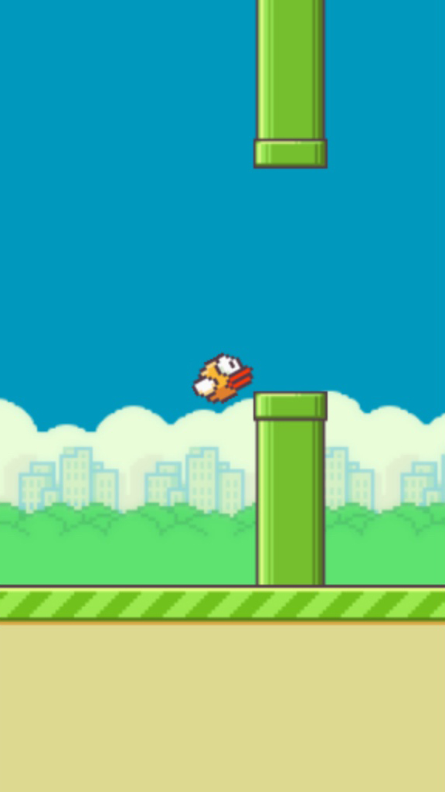

# Flappy-Bird

A clone of the Flappy Bird game created with using Pixi.js for the 2d graphics and Matter.js for the game physics.

## Controls
Hit the spacebar to bump the bird.

## License
This work is licensed under MIT
